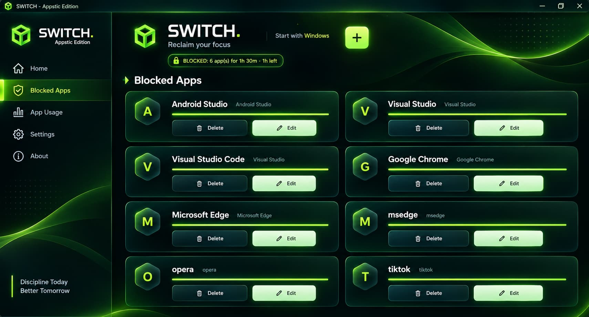

<div align="center">

  
  
  # ⚡ SWITCH_
  
  <p align="center">
    <b>The Ultimate Minimalist Focus & Goal Execution Engine for Desktop.</b><br>
    <i>Lock distractions out. Channel total flow state. Win your day.</i>
  </p>

  <p align="center">
    <a href="https://github.com/chukstechstack/SwitchInstaller/releases/latest/download/SwitchInstaller.msi">
      
    </a>
    
    
  </p>

</div>

---

## 🎬 Preview

> *Designed with deep focus, frosted glass semantics, and high-performance React architectures to give you an immersive productivity workspace.*

<div align="center">
  <br>
  <!-- Replace or point to your live banner/screenshot assets if hosted -->
  
  <br><br>
</div>

---

## ✨ Core Features

*   🎯 **Win Focus Goals** — Break down macro projects into strict execution blocks with uncompromising visual clarity.
*   🛡️ **Deep-Blur Glassmorphism** — Crafted with lightweight frosted components and dynamic contrast overlays that melt into your workflow.
*   ⚡ **Lightning Fast Performance** — Built using modern web tech stack optimizations to run effortlessly with minimal resource consumption.
*   🔒 **Zero Friction Setup** — Streamlined `.msi` installer package designed for instant deployment on Windows PCs.

---

## 📥 Quick Installation

Get up and running in seconds:

1. Head over to the **[Releases Page](https://github.com/chukstechstack/SwitchInstaller/releases/latest)**.
2. Download the latest `SwitchInstaller.msi`.
3. Run the installer and launch **SWITCH** from your desktop.

```bash
# Or download directly via PowerShell (Optional command-line option)
Invoke-WebRequest -Uri "[https://github.com/chukstechstack/SwitchInstaller/releases/latest/download/SwitchInstaller.msi](https://github.com/chukstechstack/SwitchInstaller/releases/latest/download/SwitchInstaller.msi)" -OutFile "SwitchInstaller.msi"
Start-Process "SwitchInstaller.msi"